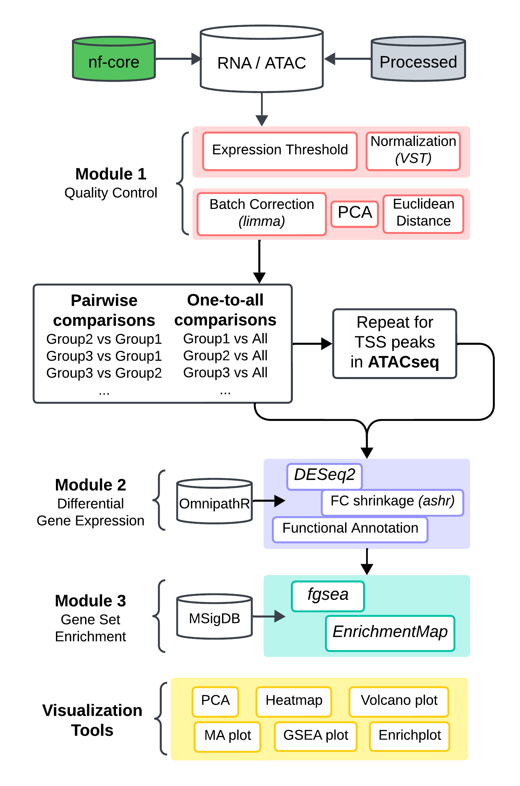

# deseq2pip: A DESeq2 Pipeline for RNA/ATAC-seq Analysis

[](https://github.com/hungms/deseq2pip/actions)
[](https://github.com/hungms/deseq2pip/actions)

## Overview

`deseq2pip` is a comprehensive R package that streamlines RNA-seq data analysis by combining DESeq2-based differential expression analysis with downstream functional analysis and visualization. The package provides a modular yet integrated workflow for quality control, differential expression analysis, gene set enrichment analysis, and visualization of results.

## Documentation

For detailed usage and documentation of all functions, please visit our latest [documentation](https://hungms.github.io/deseq2pip).


## Installation
```r
# Install devtools if not already installed
if (!requireNamespace("devtools", quietly = TRUE)) {
  install.packages("devtools")
}

# Install deseq2pip from GitHub
devtools::install_github("hungms/deseq2pip")
```

## RNAseq Quick Start

```r
# load library
library(deseq2pip)

# load deseq2 object processed by nf-core/rnaseq
rdata <- system.file("data", "GSE189410.dds.RData", package = "deseq2pip")
tx2gene <- gzfile(system.file("data", "GSE189410.tx2gene.tsv.gz", package = "deseq2pip"))
dds <- import_nfcore_rna(rdata = rdata, tx2gene = tx2gene)

# run rna pipeline
run_rna_pip(
    dds = dds, # DESeq2 object
    org = "mouse", # organism, either "mouse" or "human"
    group_by = "Group2", # column name to group by in colData(dds)
    remove_xy = TRUE, # whether to remove genes from XY chromosome
    remove_mt = TRUE, # whether to remove mitochondrial genes
    quantile = 0.05, # remove bottom 5% expressing genes
    pals = NULL, # named vector of hex colors for the group variables
    batch = NULL, # column name to batch-correct in colData(dds)
    order = "pxfc", # method to rank DEGs, either "log2FoldChange", "padj" or "pxfc"
    save_dir = getwd() # path to store results
    )
```

## ATACseq Quick Start
```r
# load library
library(deseq2pip)

# load deseq2 object processed by nf-core/atacseq
rdata <- system.file("data", "GSE224512.dds.RData", package = "deseq2pip")
annotatePeaks <- gzfile(system.file("data", "GSE224512.annotatePeaks.txt.gz", package = "deseq2pip"))
dds <- import_nfcore_atac(rdata = rdata, annotatePeaks = annotatePeaks)
dds <- dds[, dds$Group1 %in% c("WT", 'BC', 'BCK')] # subset groups for brevity

# run atac pipeline
run_atac_pip(
    dds = dds, # DESeq2 object
    org = "mouse", # organism, either "mouse" or "human"
    group_by = "Group2", # column name to group by in colData(dds)
    remove_xy = TRUE, # whether to remove genes from XY chromosome
    remove_mt = TRUE, # whether to remove mitochondrial genes
    quantile = 0.05, # remove bottom 5% expressing genes
    pals = NULL, # named vector of hex colors for the group variables
    batch = NULL, # column name to batch-correct in colData(dds)
    order = "pxfc", # method to rank DEGs, either "log2FoldChange", "padj" or "pxfc"
    TSS = TRUE, # repeat pipeline for TSS peaks
    save_dir = getwd() # path to store results
    )
```
## Pipeline Workflows
### Input requirements
Once the pipeline is initiated, pre-flight checks will be carried out to confirm if the following requirements are met:

* dds: DESeq2 object containing a count matrix: columns are samples, rows are genes
* colData(dds): must contain a `group_by` column, in addition to an optional `batch` column if specified
* rowData(dds): must contain a `gene` column. `peak` and `annotations` columns are also <b>required for ATAC-seq only</b>
* design(dds): must contain the `group_by` and `batch` columns if specified

### Subprocesses
- **Modular Pipeline**: Separate analysis steps that can be run independently or as a complete workflow
  - Quality control and data preparation
  - Differential expression analysis
  - Functional enrichment analysis
  - Visualization of results

- **Data Preprocessing**:
  - Filtering of lowly expressed genes
  - Options to remove sex chromosome genes and mitochondrial genes
  - Quality control plots (PCA, sample distance)
  - Perform batch correction methods

- **Differential Expression Analysis**:
  - Automated PAIRWISE and ONE-TO-ALL comparisons between experimental groups
  - Integrated DESeq2 workflow with convenient parameter settings
  - Comprehensive result tables with gene-level functional annotation

- **Functional Analysis**:
  - Gene set enrichment analysis (GSEA) using MSigDB gene sets
  - Support for both human and mouse organisms
  - Customizable ranking metrics and significance thresholds

- **Visualization**:
  - Publication-ready volcano plots
  - Customizable gene expression plots
  - GSEA barplots for pathway visualization
  - Support for output formatting for Cytoscape EnrichmentMap



### Output structures
Once the pipeline is complete, all output files generated from the pipeline should appear in the `save_dir` path. Below is an example directory structure after running RNA/ATAC-seq pipeline with example data:  

```
pipeline/
├── logs/                            # log directory
│   ├── renv/                        # renv
│   ├── renv.lock                    # renv
│   ├── sessionInfo.Rmd              # R session info
│   └── logfile.*                    # log files documenting dates, pipeline arguments and output messages
├── qc_results/                      # quality control directory
├── pairwise_*/                      # pairwise comparison of group variables
├── pairwise_TSS_*/                  # pairwise comparison of group variables for TSS peaks (ATACseq only)
├── one-to-all_*/                    # one-to-all comparison of group variables
└── one-to-all_TSS_*/                # one-to-all comparison of group variables for TSS peaks (ATACseq only)
```

Below is an example structure of a `qc_results` directory:  

```
qc_results/
├── dds_qc.rds                       # processed DESeq2 object
├── dds_counts.txt                   # raw count matrix
├── dds_vst.txt                      # normalized expression matrix after VST
├── low_expression.pdf               # density plot of gene expression levels
├── library_size_distribution.pdf    # boxplot of gene expression per sample
├── pca_*.tsv                        # PCA scores
├── pca_*.pdf                        # PCA plot
├── euclidean_distance.tsv           # sample euclidean distances
└── euclidean_distance.pdf           # heatmap of sample euclidean distances
```

Below is an example structure of a group directory:  

```
one-to-all_*/
├── *_vs_*/                          # example comparison
│   ├── diffexp_DESeq2.tsv           # differential expression dataframe
│   ├── diffexp_ma.pdf               # MA plot
│   ├── diffexp_volcano.pdf          # volcano plot
│   ├── peak_annotation_*.pdf        # annotation pie chart for DE peaks (ATACseq only)
│   ├── gsea_*.rds                   # gsea object from clusterprofiler
│   ├── gsea_*.tsv                   # gsea result dataframe
│   └── gsea_*_barplot.pdf           # barplot of enriched gene set terms
└── enrichmentmap/                   # density plot of gene expression levels
    ├── dds_counts.txt               # raw count matrix
    ├── *_msigdbr.gmt                # all gene set terms used
    ├── *_class.cls                  # class file
    ├── *_diffexp_DESeq2_rank.rnk    # DEG rankings
    └── *_enrichments.tsv            # GSEA results
```
  
## License

This package is distributed under the MIT License.

## Contributing

Contributions are welcome! Please feel free to submit a Pull Request.

## Contact

For questions or issues, please open an issue on GitHub.